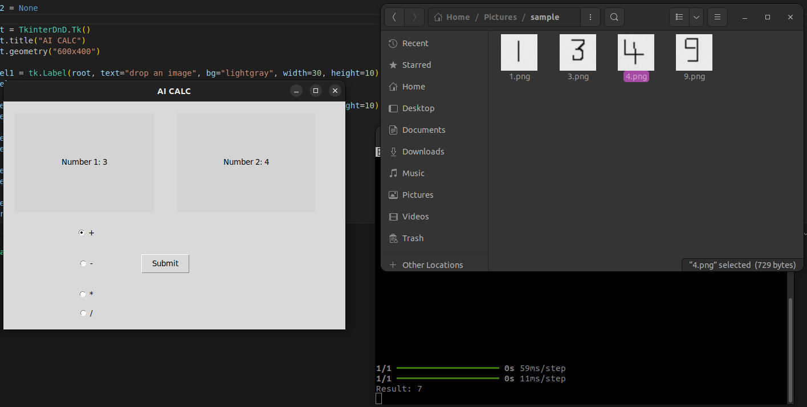

# Artificial_Intelligence

## AI Calculator

### Description:
This project is an AI-powered calculator that uses a pre-trained model to recognize handwritten numbers from images. The model, built with Keras, is trained on the MNIST Dataset. The calculator can perform basic arithmetic operations (addition, subtraction, multiplication, division) on two numbers, which are provided by the user through drag-and-drop images.

### Key Features:
- **Handwritten Digit Recognition**: Utilizes a convolutional neural network (CNN) model to predict digits from images.
- **Drag-and-Drop Interface**: Implemented using Tkinter and TkinterDnD for a user-friendly drag-and-drop experience.
- **Basic Arithmetic Operations**: Supports addition, subtraction, multiplication, and division.
- **Real-time Predictions**: Processes images and predicts numbers in real-time.

### Skills Demonstrated:
- **Deep Learning with Keras and TensorFlow**: Trained and deployed a CNN model for digit recognition.
- **Computer Vision with OpenCV**: Preprocessed images for model prediction.
- **GUI Development with Tkinter**: Created an interactive graphical user interface.
- **Integration of ML Models into Applications**: Loaded a pre-trained model and used it in a functional application.
### Preview:

## YouTube Summarizer

### Description:
This project is a YouTube video summarizer that generates concise summaries of video content using the Hugging Face summarization model. It extracts video transcripts using the YouTube Transcript API and creates summaries with the `facebook/bart-large-cnn` model. The application is built with Streamlit for an interactive web interface.

### Key Features:
- **Video Transcript Extraction**: Uses the YouTube Transcript API to fetch the transcript of a video.
- **Summary Generation**: Utilizes Hugging Face's BART model for generating summaries.
- **Streamlit Interface**: Provides a user-friendly web interface for entering YouTube URLs and viewing summaries.

### Skills Demonstrated:
- **Text Extraction from Video**: Retrieved and processed video transcripts using `youtube_transcript_api`.
- **Summarization with Transformers**: Employed Hugging Face’s summarization pipeline to generate text summaries.
- **Web Development with Streamlit**: Developed an interactive web application for proof of concept.

### Preview:
