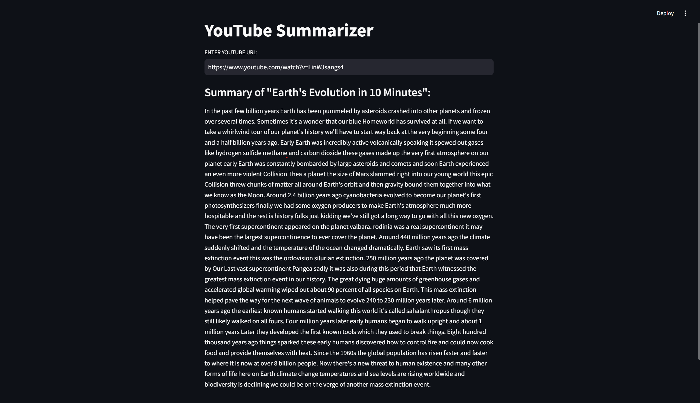
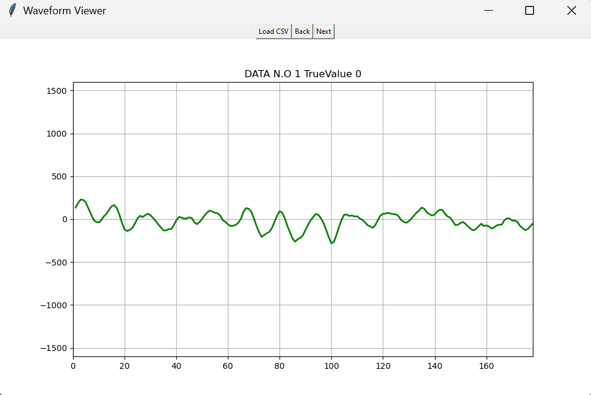
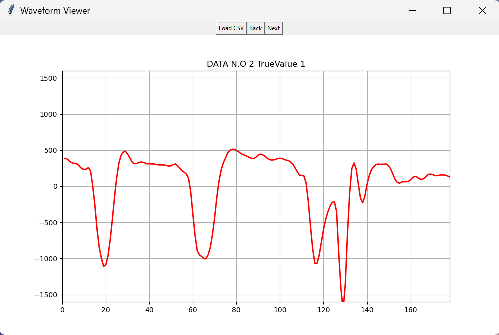

# Artificial_Intelligence

## Index
- [AI Calculator with CNN](#ai-calculator)
- [YouTube Summarizer with Bart-large-cnn](#youtube-summarizer)
- [Seizure Recognition with Bert-base-uncased](#seizure-recognition)

## AI Calculator

### Description:
This project is an AI-powered calculator that uses a pre-trained model to recognize handwritten numbers from images. The model, built with Keras, is trained on the MNIST Dataset. The calculator can perform basic arithmetic operations (addition, subtraction, multiplication, division) on two numbers, which are provided by the user through drag-and-drop images.

### Key Features:
- **Handwritten Digit Recognition**: Utilizes a convolutional neural network (CNN) model to predict digits from images.
- **Drag-and-Drop Interface**: Implemented using Tkinter and TkinterDnD for a user-friendly drag-and-drop experience.
- **Basic Arithmetic Operations**: Supports addition, subtraction, multiplication, and division.
- **Real-time Predictions**: Processes images and predicts numbers in real-time.

### Skills Demonstrated:
- **Deep Learning with Keras and TensorFlow**: Trained and deployed a CNN model for digit recognition.
- **Computer Vision with OpenCV**: Preprocessed images for model prediction.
- **GUI Development with Tkinter**: Created an interactive graphical user interface.
- **Integration of ML Models into Applications**: Loaded a pre-trained model and used it in a functional application.
### Preview:

## YouTube Summarizer

### Description:
This project is a YouTube video summarizer that generates concise summaries of video content using the Hugging Face summarization model. It extracts video transcripts using the YouTube Transcript API and creates summaries with the `facebook/bart-large-cnn` model. The application is built with Streamlit for an interactive web interface.

### Key Features:
- **Video Transcript Extraction**: Uses the YouTube Transcript API to fetch the transcript of a video.
- **Summary Generation**: Utilizes Hugging Face's BART model for generating summaries.
- **Streamlit Interface**: Provides a user-friendly web interface for entering YouTube URLs and viewing summaries.

### Skills Demonstrated:
- **Text Extraction from Video**: Retrieved and processed video transcripts using `youtube_transcript_api`.
- **Summarization with Transformers**: Employed Hugging Face’s summarization pipeline to generate text summaries.
- **Web Development with Streamlit**: Developed an interactive web application for proof of concept.

### Preview:

## Seizure Recognition 

### Description:
This project aims to advance the detection of seizures using EEG signals by fine-tuning the `Bert-base-uncased` model, originally designed for text processing. By adapting this model, the project leverages the powerful memory and contextual understanding capabilities of transformers, making it exceptionally well-suited for the nuanced patterns in EEG data. Traditional machine learning models often struggle with capturing long-term dependencies in sequential data, but the encoder model used here excels in this regard, enabling more accurate classification of EEG signals as either seizure or normal.

### Key Features:

1. **Innovative Use of Transformers:** Applying a BERT-based model, typically used for natural language processing, to EEG data demonstrates an innovative approach to a medical challenge. This cross-domain application highlights the versatility and potential of transformer models beyond text processing.
2. **High Accuracy:** Achieving over 96% accuracy in seizure detection is a significant achievement, indicating the model's robustness and reliability. This level of precision is crucial in medical applications where accurate diagnosis can be life-saving.
3. **Efficiency in Handling Sequential Data:** The use of an encoder model over traditional machine learning algorithms addresses the challenge of capturing temporal dependencies in EEG signals. This results in a more effective analysis of the complex patterns associated with seizure activity.
4. **Scalability and Adaptability:** The approach can be adapted and scaled for other types of medical signal analysis, making it a valuable contribution to the broader field of biomedical engineering and AI.

Overall, this project is not only a technical achievement but also a demonstration of how advanced AI models can be repurposed to tackle critical challenges in healthcare.

### Skills Demonstrated:
- **Fine-Tuning Transformer Models**: Fine-tuned the `Bert-base-uncased` model for the specific task of EEG signal classification, demonstrating expertise in adapting advanced NLP models for non-text data.
- **Seizure Detection with EEG Signals**: Applied deep learning techniques to classify EEG data, showcasing the ability to handle complex biomedical datasets.
- **Signal Processing and Analysis**: Managed and processed EEG signals effectively, extracting relevant features for accurate classification.
- **Model Optimization and Evaluation**: Achieved over 96% accuracy, highlighting skills in model training, hyperparameter tuning, and evaluation.
- **Innovative Application of NLP Models**: Successfully adapted a model designed for text to a medical domain, demonstrating creativity and cross-disciplinary knowledge.

### Preview:

- To run the application run `application.py`
- To Generate model run `epileptic_seizer_recognition.py`
- To evaluate the model run `evaluate.py`

- **Red** indicates seizure
- **Green** indicates normal
